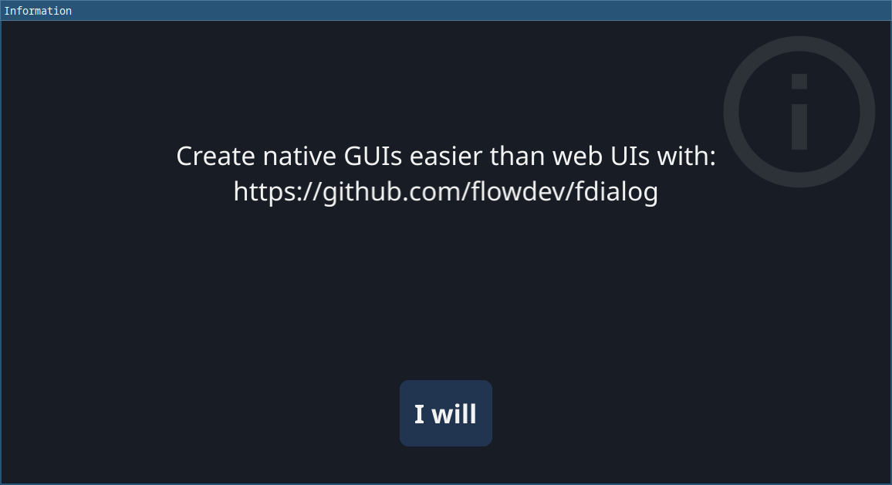

# fdialog - Create Native GUIs With Ease



## Installation

### Install Script

Download `fdialog` and install into a local bin directory.

#### MacOS, Linux, WSL

Latest version:

```bash
curl -L https://raw.githubusercontent.com/flowdev/fdialog/main/generated/install.sh | sh
```

Specific version:

```bash
curl -L https://raw.githubusercontent.com/flowdev/fdialog/main/generated/install.sh | sh -s 0.0.4
```

The script will install the binary into `$HOME/bin` folder by default, you can override this by setting
`$CUSTOM_INSTALL` environment variable

### Manual download

Get the archive that fits your system from the [Releases](https://github.com/https://github.com/flowdev/fdialog/releases) page and
extract the binary into a folder that is mentioned in your `$PATH` variable.

## Usage

The basic usage is:
```shell
fdialog run --file dialog.uidl
```

Please run `fdialog help` for more information.

## Notes

The UIDL file format is documented [here](./UIDL.md).

The project has been scaffolded with the help of [kleiner](https://github.com/can3p/kleiner)
